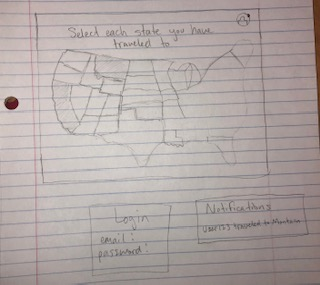

# Startup
**startup project for CS260: Map Your Travels**


## Elevator Pitch
Are you a big traveler but often forget all of the places you've been? With this app, you can easily keep track of every place you've traveled with an interactive map. Just select a state you have set foot in and the app will color it in. You can also add your friends and be notified when they have been to a new place. (Disclaimer: Since this is brand new, it will only be the states, but soon it will be a map of the whole world!) \
 \
Key Features
* Secure login over HTTPS
* Display map of U.S.
* Ability to select a state
* Colors in state
* Save states
* Notifies when others have selected a state


## Notes

### Git
`git clone <git url>` \
`code .` opens the directory in VS Code \
`nslookup` is Git Bash's `dig` \
_What I learned from GitHub assignment:_ fetch then pull and stage, commit, push

### Server Stuff
HTTP (Hypertext Transport Protocol) \
HTTPS (Secure HTTP) \
TLD (Top Level Domain): com, org, click, etc. \
DNS (Domain Name System)
- `A` records are straight mappings from a domain name to an IP address
- `CNAME` records map one domain name to another domain name

My IP address: 3.133.80.15 \
My domain: tingey.click \
How to SSH into my server: `ssh -i ~/Desktop/cs260/production.pem ubuntu@3.133.80.15` \
After changing files in the server, **don't forget to restart Caddy**: `sudo service caddy restart` \
Deploy to server: `./deployWebsite.sh  -k ~/Desktop/cs260/production.pem -h 3.133.80.25` \
Deploy to Simon: `./deployService.sh -k ~/Desktop/cs260/production.pem -h tingey.click -s simon` \
Deploy to Startup: `./deployService.sh -k ~/Desktop/cs260/production.pem -h tingey.click -s startup`

### HTML
Hypertext Markup Language \
provides the foundational content structure for web apps

_element:_ head, body, main \
_tag:_ contained in <> \
_attribute:_ describe the specific details of an element \
`id` attribute is for unique things \
`class` attribute is for a group of things \
use & for special characters and unicode

_block element:_ distinct block in the flow of the content structure \
_inline element:_ inline with the content flow of a block element

_What I learned from Simon HTML assignment:_ I really need to learn more about svg, Caddy needs one of the files to be named index.html

### CSS
Cascading Style Sheets \
stylizes the HTML by defining rules \
associate CSS with HTML by putting `<link href="styles.css" />` in the head element

CSS box: content, padding, border, margin

**Selectors** 
- _selector:_ selects the elements to apply the rule to and one or more _declarations_ that represent the _property_ to style with a _property value_
- wildcard selector: `*`
- Combinators 
  - descendant: `section h2`
  - child: `section > p`
  - general sibling: `p ~ div`
  - adjacent sibling: `p + div`
- class selector: `.summary`
- id selector: `#physics`
- attribute selector: `p[class='summary']`
- pseudo selector: `section:hover` for positional relationships, mouse interactions, hyperlink visitation states, and attributes 

**Responsive Design**
- _responsive design:_ the ability to reconfigure the interface so the application accommodates and takes advantage of screen size and orientation
- `<meta name="viewport" content="width=device-width,initial-scale=1" \>` tells the browser not to scale the page
- _float:_ moves an element to the left or right of its container element and allows inline elements to wrap around it
- `@media` selector detects the size and orientation of the device
- Grid
  - used to display a group of child elements in a responsive grid
  - `display: grid` in the container element
- Flex
  - used to partition the app into areas that responsively move around as the window resizes or the orientation changes
  - _in parent element_
    - `display: flex`
    - `flex-direction:` column, row, column-reverse, or row-reverse
    - `flex-wrap:` allows the items to wrap as screen size changes; nowrap, wrap, or wrap-reverse
    - `flex-flow:` combines previous 2 properties
    - `justify-content:` defines the alignment along the main axis (depends on flex-direction); flex-start, flex-end, center, space-between, space-around, space-evenly
    - `align-items:` defines the alignment along the cross axis; stretch (default), flex-start, flex-end, center, baseline
    - `align-content:` aligns a flex container's lines within when there is extra space in the cross axis; normal (default), flex-start, flex-end, center, space-between, space-around, space-evenly, stretch
    - `gap: 50px` controls the space between flex items (not the outer edges)
  - _in child elements_
    - `order:` controls the order in which flex items appear in the flex container
    - `flex:` allows a flex item to grow or shrink if necessary
      - `flex: 0 50px` means it will not grow and has a starting basis height of 50px
      - `flex: 1` means it will get one fractional unit of growth
    - `align-self:` allows the default alignment (align-items) to be overridden for specific flex items

itegrate Bootstrap with `<link
      href="https://cdn.jsdelivr.net/npm/bootstrap@5.2.3/dist/css/bootstrap.min.css"
      rel="stylesheet"
      integrity="sha384-rbsA2VBKQhggwzxH7pPCaAqO46MgnOM80zW1RWuH61DGLwZJEdK2Kadq2F9CUG65"
      crossorigin="anonymous"
    />` \
 if you are going to use Bootstrap components that require JavaScript (buttons), put `<script src="https://cdn.jsdelivr.net/npm/bootstrap@5.2.3/dist/js/bootstrap.bundle.min.js"
    integrity="sha384-kenU1KFdBIe4zVF0s0G1M5b4hcpxyD9F7jL+jjXkk+Q2h455rYXK/7HAuoJl+0I4"
    crossorigin="anonymous"><\script>` \
 at the end of the HTML body element

_What I learned from Simon CSS assignment:_ There is just too much stuff to remember so multiple reference pages need to be open

### JS
weakly typed language that makes webpages interactive \
add JS to HTML with `<script src="javascript.js"></script>` \
use `onclick` attribute of a button element to call a JS function

`console.log()` outputs to the debugger console \
Use `let` or `const` to declare a variable \
`===` is strict equality \
`for in` loop iterates over indexes in a list \
`for of` loop iterates over elements in a list \
`break` will break out of a loop and `continue` will advance the loop \
NaN: not a number

_string literal:_ evaluate JS inside of a string, use back ticks instead of quotes, use $ to denote the JS

String Functions
- `length` returns the number of characters in a string
- `indexOf` returns the starting index of a given substring
- `split` splits the string in to an array on the given delimiter string
- `startsWith` returns true if the string has a given prefix
- `endsWith` returns true if the string has a given suffix
- `toLowerCase` converts all characters to lowercase

Functions
- first class objects: treated like a variable; can be assigned a name, passed as a parameter, returned as a result
- `function myFunction() {}` defines a function
- anonymous function: `const myFunction = function() {}
- inner function: declared inside another function
- arrow function: `() => 3` makes the code more compact; use when returning a function or passing a function as a parameter

Array Functions
- `push` adds an item to the end of the array
- `pop` removes an item from the end of the array
- `values` creates an iterator to use with a for of loop
- `find` finds the first item satisfied by a given test function
- `forEach` runs a given function on each array item
- `map` runs a given function to map an array to a new array
- `filter` runs a given function to remove items
- `every` runs a given function to test if all the items match
- `some` runs a given function to test if any of the items match

Objects
- a collection of name value pairs
- name must be of type String or Symbol
- created with `new` operator or with object-literal syntax
  - const obj = new Object()
  - const obj = { a: 3}
-Functions
  - `entries` returns an array of key value pairs
  - `keys` returns an array of keys
  - `values` returns an array of values
  
Classes
- clarifies the intent to create a reusable component rather than a one off object
- ```JavaScript
  class Person {
    constructor(name) {
      this.name = name;
    }
    log() { 
      console.log('My name is' + this.name);
    }
   }
  ```
- make variables and fuctions private with `#`
- Inheritance
  - `class Employee extends Person`
  - parameters that need to be passed to the parent class are delivered using the `super` function
  - parent functions can be accessed using the `super` keyword

convert JS to JSON: `JSON.stringify()` \
convert JSON to JS: `JSON.parse()`

_regular expressions:_ textual pattern matchers; use to find text in a string \
`const petRegex = /(dog)|(cat)|(bird)/gim` \
`rest` allows a function to take in an unknown number of parameters as an array \
`spread` allows you to pass and array as a list of parameters into a function \
_destructuring:_ the process of pulling individual items out of an existing array or object

DOM (Document Object Model)
- object representation of the HTML elements that the browser uses to render the display
- use `document` to dynamically manipulate the HTML in JS
- `querySelector()` function selects elements from the document
- `textContent` property contains all of the element's text
- `innerHTML` property accesses a textual representation of an element's HTML content
- `createElement()`
- `appendChild()`
- `removeChild()`

JS is single threaded - only one thread can run at a time \
`Promise` object allows you to asynchronously execute code

What I learned from Simon JS assignment: localStorage.setItem() lets you store the user's data like usernames and passwords

### Web Services
URL (Uniform Resource Locator): location of a web resource 

Common Ports
- SSH: port 22
- DNS: port 53
- HTTP: port 80
- HTTPS: port 443

**HTTP** \
Common Verbs
- GET: get the requested resource
- POST: create a new resource
- PUT: update a resource
- DELETE: delete a resource
- OPTIONS: get metadata about a resource

Status Codes
- 100's: informational
- 200's: success
- 300's: redirect to some other location; previously cached resource is still valid
- 400's: client error, request is invalid
- 500's: server error

Headers: specify metadata about a request or response \
Common Headers
- Authorization: a token that authorized the user making the request
- Accept: what content formal the client accepts
- Content-Type: the format of the response content
- Cookie: key-value pairs that are generated by the server and stored on the client
- Host: the domain name of the server, required in all requests
- Origin: identifies the origin that caused the request
- Access-Control-Allow-Origin: server response of what origins can make a request
- Content-Length: the number of bytes contained in the response
- Cache-Control: tells the client how it can cach the response
- User-Agent: the client application making the request

SOP (Same Origin Policy): only allows JS to make requests to a domain if it is the same domain the the user is currently viewing \
CORS (Cross Origin Resourse Sharing): allows the client to specify the origin of a request and then let the server respond with what origins are allowed

**Fetch** \
returns a promise 
```JavaScript
fetch('https://api.quotable.io/random')
  .then((response) => response.json())
  .then((jsonResponse) => {
    console.log(jsonResponse);
  });
```
`.json()` converts the response object to JS \
you can add an object parameter to pass a specific request and headers:
```JavaScript
fetch('https://jsonplaceholder.typicode.com/posts', {
  method: 'POST',
  body: JSON.stringify({
    title: 'test title',
    body: 'test body',
    userId: 1,
  }),
  headers: {
    'Content-type': 'application/json; charset=UTF-8',
  },
})
  .then((response) => response.json())
  .then((jsonResponse) => {
    console.log(jsonResponse);
  });
```

**Endpoints** \
also called an API (Application Programming Interface) \
make sure the endpoints you design are:
- grammatical
- readable
- discoverable
- compatible
- simple
- documented

exposing endpoints
- RPC (Remote Procedure Calls): expose service endpoints as simple function calls
- REST (Representational State Transfer): attempts to take advantage of the foundational principles of HTTP
- GraphQL: focuses on the manipulation of data

**Node** \
allows JS to run inside a console application \
ititialize code to use npm: `npm init -y` \
install packages: `npm install` \
uninstall packages: `npm uninstall` \
IMPORTANT: make sure the `.gitignore` file contains `node_modules/` 

**Express** \
allows:
- routing requests for service endpoints
- manipulating HTTP requests with JSON body content
- generating HTTP responses
- using middleware to add functionality

How to make an express application:
```JavaScript
const express = require('express');
const app = express();
```

Routing Functions
- supports HTTP verbs as functions on the object
- called only if the pattern matches
- `app.get(<url path>, (req, res, next) => {})`

Middleware
- called for every HTTP request unless a previous middle ware function does not call `next`
- write your own: `app.use((req, res, next)) => {next();}`

daemon: keeps programs running after a shutdown \
PM2 (Process Manager 2)

put all the front-end code files into a folder called `public` \
middleware that serves `public` to the browser: `app.use(express.static(‘public’)` \
automatically parse incoming requests: `app.use(express.json())`

**MongoDB** \
uses JSON objects as its core data model \
stores arrays of objects, each with a unique ID, in a collection  \
the `.find` function on a collection is asynchronous \
connection string to cluster: `mongodb+srv://<username>:<password>@<hostname>` \
store username, password, and hostname as environment variables on computer and on server so they don't get stolen

**Authentication** \
store authentication token in a cookie \
use `uuid` package to randomly generate a unique ID \
use `bcrypt` package to encrypt passwords

**WebSockets** \
an open connection between the client and the server \
now the server can send data to the client whenever without a request \
how to create a websocketserver that listens on port 9900: `const socket = new WebSocket('ws://localhost:9900')` \
use `.send` function to send messages \
use `.onmessage` function to receive messages \
use `ping` and `pong` to keep the connections alive 

### React
Combines JS and HTML into JSX which gets interpreted by Babel \

Components
- defined as functions (used to be classes)
- render function: turns components into HTML elements 
  - `<Function />`
  - `ReactDOM.render(hello, document.getElementById('root'))`
- you can pass in information to components in the form of element properties 
  - `<Function name="Bob" />
- State: created by calling the `React.useState` hook function, which returns a variable and a function to update the state
  - `const [clicked, updateClicked] = React.useState(false)`
  - 
makes the UI react to user input \
When a component's JSX is rendered, React parses the JSX and creates a list of any references to the component's `state` or `prop` objects \
React then monitors those objects and if it detects that they have changed, it will call the component's `render` function \

Hooks
- allow React function style components to be able to do everything that a class style component can do and more
- `useState`: used to declare and update state in a function component
- `useEffect`: used to represent lifecycle events
- If you specify `[]` as the hook dependency, then it is only called when the component is first rendered
